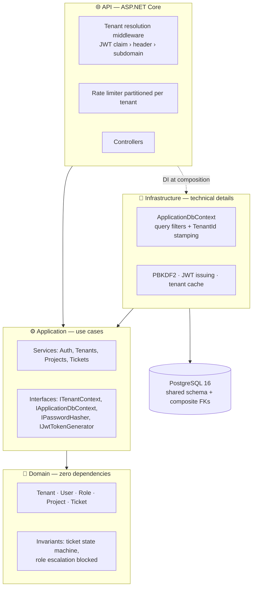

# MultiTenant SaaS API

A multi-tenant API starter for a helpdesk-style SaaS product, built with .NET 8, Clean
Architecture and PostgreSQL, with data isolation enforced at three independent levels.

[](https://github.com/georgepanfil87/multitenant-saas-api/actions/workflows/ci.yml)


```bash
cp .env.example .env && docker compose up -d
# → http://localhost:8080/swagger
```

---

## The problem

In a B2B SaaS product, several client organizations share one database. A single query that
forgets `WHERE TenantId = ...` leaks one client's data to another, and the consequence is not
a display bug but a security incident with notification obligations.

The usual approach, "we add the filter to every query", fails predictably: it takes one miss,
in one endpoint, at 6pm on a Friday.

## The solution

Isolation is inherited, not written. An entity implementing `ITenantEntity` automatically gets:

- a read filter (EF Core global query filter, applied over the model by reflection),
- `TenantId` stamped on write, inside `SaveChanges`,
- an integrity constraint in PostgreSQL, through composite foreign keys.

The concrete result: across the entire CRUD layer, the word `TenantId` never appears.

```bash
$ cd src/MultiTenantSaaS.Application/Features
$ grep -vE '^\s*(//|///)' Projects/ProjectService.cs Tickets/TicketService.cs | grep -c TenantId
0
```

The only occurrences are in the comments explaining why it is absent.

---

## Architecture



**The dependency rule:** arrows only point inward. `Domain` has zero NuGet packages;
`Application` knows the EF Core abstractions but not the PostgreSQL provider.

| Layer | Role | Not allowed |
|---|---|---|
| **Domain** | Entities, business invariants | Any NuGet package |
| **Application** | Use cases, DTOs, interfaces | Npgsql, `HttpContext`, the concrete `DbContext` |
| **Infrastructure** | EF Core, hashing, JWT, caching | Business logic |
| **Api** | Thin controllers, middleware, DI | Direct EF queries |

---

## Running it locally

**Requirements:** Docker. That is all — the .NET SDK is only needed for development and tests.

```bash
git clone <repo> && cd multitenant-saas-api
cp .env.example .env          # change the passwords before any public exposure
docker compose up -d
```

The stack starts PostgreSQL, waits until it **accepts connections** (not merely until the
container starts), applies the migrations and seeds three demo organizations.

| Service | URL |
|---|---|
| Swagger | http://localhost:8080/swagger |
| Health check | http://localhost:8080/health |
| PostgreSQL | `localhost:5432` |
| pgAdmin (optional) | http://localhost:5050 — `docker compose --profile tools up -d` |

### Demo accounts

All use the password `Demo123!parola`.

| Organization | Plan | User | Role |
|---|---|---|---|
| `acme` | Pro | `admin@acme.ro` | TenantAdmin |
| `acme` | Pro | `maria@acme.ro` | Member |
| `globex` | Free | `admin@globex.ro` | TenantAdmin |
| `initech` | Enterprise | `admin@initech.ro` | TenantAdmin |
| `system` | — | `platform@exemplu.ro` | GlobalAdmin |

Note that `acme` and `globex` each own a project with the code `SUP`: uniqueness is
`(TenantId, Code)`, not global.

---

## Isolation demo, in 4 commands

```bash
# 1. Log in to Acme
TOKEN=$(curl -s -X POST http://localhost:8080/api/auth/login \
  -H 'Content-Type: application/json' -H 'X-Tenant: acme' \
  -d '{"email":"admin@acme.ro","password":"Demo123!parola"}' | jq -r .accessToken)
```

```bash
# 2. Acme's tickets — the organization comes from the token, not from a parameter
curl -s http://localhost:8080/api/tickets -H "Authorization: Bearer $TOKEN" | jq '.totalCount'
# → 5
```

```bash
# 3. Log in to Globex and request one of Acme's projects, by its exact id
OTHER=$(curl -s -X POST http://localhost:8080/api/auth/login \
  -H 'Content-Type: application/json' -H 'X-Tenant: globex' \
  -d '{"email":"admin@globex.ro","password":"Demo123!parola"}' | jq -r .accessToken)

PROJ=$(curl -s http://localhost:8080/api/projects -H "Authorization: Bearer $TOKEN" | jq -r '.items[0].id')
curl -s -o /dev/null -w '%{http_code}\n' http://localhost:8080/api/projects/$PROJ \
  -H "Authorization: Bearer $OTHER"
# → 404   (not 403: a 403 would confirm the resource exists)
```

```bash
# 4. Acme's token with Globex's header — an attempt to switch organization
curl -s -o /dev/null -w '%{http_code}\n' http://localhost:8080/api/tickets \
  -H "Authorization: Bearer $TOKEN" -H 'X-Tenant: globex'
# → 403   "Inconsistent tenant"
```

---

## Security model

Isolation rests on three **independent** layers. Each one catches what the previous would
have missed.

| # | Layer | What it stops | Where |
|---|---|---|---|
| 1 | **Global query filter** | Reading another tenant's data | `ApplicationDbContext.OnModelCreating` |
| 2 | **Stamping on `SaveChanges`** | Writing into another tenant, moving a row between tenants | `ApplicationDbContext.StampTenantAndAudit` |
| 3 | **Composite foreign keys** | Any cross-tenant reference, including from raw SQL | `TicketConfiguration` |

The third layer, verified directly in `psql`, bypassing the application entirely:

```
ERROR:  insert or update on table "Tickets" violates foreign key constraint
        "FK_Tickets_Projects_TenantId_ProjectId"
DETAIL: Key (TenantId, ProjectId)=(bbbb…, cccc…) is not present in table "Projects".
```

On top of those:

- **`TenantId` has no public setter.** No application code can assign a tenant; the value is
  written exclusively by the `DbContext`, through the change tracker.
- **The token beats the header.** An authenticated user cannot switch organization with a
  header; a mismatch returns `403`.
- **Fail closed.** With no tenant resolved, the filter compares against `Guid.Empty` and
  returns no rows, while writes throw. A resolution bug produces `404`s, not data exposure.
- **The `GlobalAdmin` role cannot be granted through the API**, neither on create nor on update.

---

## Design decisions

### Why shared database + shared schema, rather than schema-per-tenant

| | **Shared schema** (chosen) | Schema per tenant | Database per tenant |
|---|---|---|---|
| Isolation | Logical, via filters + FKs | Physical, at schema level | Physical, complete |
| Migrations | **One, for everyone** | N schemas × each migration | N databases × each migration |
| Onboarding | One `INSERT` | `CREATE SCHEMA` + migrate | Database provisioning |
| Cost at 1,000 tenants | Unchanged | 1,000 schemas to migrate | Prohibitive |
| Connection pooling | A single pool | Pool per schema or `SET search_path` | Pool per database |
| Risk | One filter mistake is a leak | Better isolation | Best isolation |
| Per-client restore | Complex | Medium | **Trivial** |

**The choice:** shared schema, because in a SaaS with many small organizations — the typical
helpdesk profile — the operational cost of the other two dominates any advantage they bring.
Migrating 1,000 tenants is one operation, not 1,000.

**The risk, stated explicitly:** isolation is logical, so it depends on the code being correct.
The answer is not "we are careful", it is the three independent layers above, one of which —
the composite foreign keys — cannot be bypassed even by hand-written SQL.

**When I would revisit it:** enterprise clients with data residency or individual restore
requirements. The model supports the migration: `TenantId` already exists on every row, so
extracting one client into its own database is a data operation, not a rewrite.

### Other decisions, briefly

| Decision | Rejected alternative | Reason |
|---|---|---|
| Custom `User` entity | ASP.NET Core Identity | Identity enforces **globally** unique emails; in B2B SaaS the same person may hold accounts at two clients. The correct uniqueness is `(TenantId, Email)` |
| `Guid` primary keys | `int` auto-increment | Sequential ids enable enumeration and leak the platform's volume |
| Global admins in a system tenant | `Guid? TenantId` with `null` = platform | Keeps `TenantId` non-nullable everywhere, so the filter stays a plain equality. The `\|\| TenantId == null` branch is exactly where leaks appear |
| `IApplicationDbContext` | Repository per aggregate | No boilerplate, full LINQ. `IQueryable` escapes through a repository anyway, making the abstraction decorative |
| Plain services | CQRS with MediatR | The point of the project is multi-tenant isolation, not indirection |
| Token bucket rate limiting | Fixed window | Separates allowed burst from sustained rate; a fixed window permits double the quota at the window boundary |
| Explicit `IgnoreQueryFilters()` | A bypass flag inside the filter | Every exit from isolation becomes a one-second `grep` and an obvious point in code review |
| PBKDF2-HMAC-SHA512, 210k iterations | BCrypt / Argon2id | In the standard library, no dependencies. The iteration count lives inside the hash, so it can be raised later |

---

## What the API offers

15 endpoints, grouped into 6 sections in Swagger.

| Method | Route | Access |
|---|---|---|
| `POST` | `/api/tenants/register` | public — creates organization + admin + seed data, in one transaction |
| `GET` | `/api/tenants` | GlobalAdmin |
| `POST` | `/api/auth/login` | public (`X-Tenant` header) |
| `GET` | `/api/auth/me` | authenticated |
| `POST` | `/api/users` | TenantAdmin |
| `GET · POST · PUT · DELETE` | `/api/projects` | read: anyone; write: TenantAdmin |
| `POST` | `/api/projects/{id}/archive` · `/restore` | TenantAdmin |
| `GET · POST · PUT` | `/api/tickets` | authenticated |
| `PATCH` | `/api/tickets/{id}/status` · `/assignee` | authenticated |
| `DELETE` | `/api/tickets/{id}` | TenantAdmin |
| `GET` | `/health` | public |

Listings are paginated (`?page=1&pageSize=20`, capped at 100) and filterable.

---

## Testing

```bash
dotnet test
```

```
MultiTenantSaaS.UnitTests         95 tests   ~1s   in-memory provider
MultiTenantSaaS.IntegrationTests  17 tests   ~2s   PostgreSQL 16 via Testcontainers
```

The integration tests spin up a throwaway PostgreSQL container, apply the migrations and go
through the complete HTTP pipeline. They exist because the in-memory provider has no SQL,
foreign keys or transactions: two real bugs passed the unit tests and were caught only here —
a projection EF Core could not translate, and pagination that failed to bind from the query
string because of a name collision in model binding. Both now have regression tests.

**Multi-tenancy scenarios covered:** filtered listing, a `totalCount` that does not leak other
tenants' row counts, access using another tenant's exact id, ids arriving in the request body,
writing with no tenant resolved, moving a row between tenants, token-over-header precedence,
per-tenant uniqueness, onboarding atomicity, role escalation and cascade deletes.

---

## Project structure

```
src/
├── MultiTenantSaaS.Domain/          entities, enums, invariants — zero dependencies
├── MultiTenantSaaS.Application/     use cases, DTOs, interfaces
├── MultiTenantSaaS.Infrastructure/  EF Core, migrations, PBKDF2, JWT, tenant cache
└── MultiTenantSaaS.Api/             controllers, middleware, Swagger, DI
tests/
├── MultiTenantSaaS.UnitTests/
└── MultiTenantSaaS.IntegrationTests/
```

---

## Deliberately out of scope

These are scope limits, not oversights:

- **Refresh tokens and revocation.** A token is valid for 60 minutes and cannot be invalidated.
- **Email verification** when registering an organization.
- **Distributed rate limiting.** The limiter is in-memory, so N instances mean N × the quota.
  The production answer is a Redis-backed limiter.
- **Custom roles per organization.** The three levels are fixed.
- **Audit log** of sensitive operations.

---

## Configuration

Production reads everything from environment variables; `appsettings.json` contains no
connection string and no keys. The credentials in `appsettings.Development.json` exist solely
for the local PostgreSQL container.

| Variable | Description |
|---|---|
| `ConnectionStrings__DefaultConnection` | PostgreSQL connection string |
| `Jwt__SigningKey` | HMAC key, at least 32 characters. Validated **at startup** |
| `Database__AutoMigrate` | Apply migrations on startup. Keep `false` in production with multiple replicas |
| `Database__SeedDemoData` | Seed the demo organizations. Idempotent |
| `RateLimiting__*` | Per-plan quotas, overridable per tenant from the database |

---

## Licence

MIT
